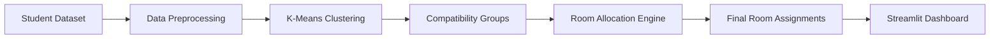

# 🏠 Smart Hostel Room Manager

> **An AI-powered hostel room allocation system that uses Machine Learning to group compatible students and optimize roommate assignments based on lifestyle preferences and behavioral patterns.**

<p align="center">


</p>

---

# 📖 Overview

**Smart Hostel Room Manager** is an AI-assisted room allocation system designed to improve hostel accommodation by matching students with compatible roommates.

The project applies **Machine Learning clustering techniques** to analyze student preferences such as sleep schedules, study habits, cleanliness, smoking preferences, and hometown information. Based on these characteristics, the system groups similar students and generates optimized room assignments.

A **Streamlit web application** provides an interactive interface for uploading student data, generating synthetic datasets, and visualizing room allocations.

---

# 🎯 Project Objectives

* Improve roommate compatibility
* Reduce room allocation conflicts
* Automate manual hostel assignments
* Demonstrate practical applications of Machine Learning
* Build an interactive AI-powered decision support system

---

# ✨ Key Features

* 🤖 AI-based roommate recommendation
* 🧠 K-Means clustering for compatibility analysis
* 📊 Synthetic student data generation
* 📂 CSV upload and processing
* 🛏 Configurable room capacity
* ⚡ Interactive Streamlit dashboard
* 📈 Automated room allocation
* 🔄 Modular machine learning pipeline
* 📝 Allocation logging for analysis

---

# 🏗 System Architecture



---

# 🔄 Workflow

```text id="dr8e5v"
Student Preferences
        │
        ▼
Data Cleaning
        │
        ▼
Feature Engineering
        │
        ▼
K-Means Clustering
        │
        ▼
Compatibility Groups
        │
        ▼
Room Assignment
        │
        ▼
Interactive Dashboard
```

---

# 🛠 Technology Stack

| Category             | Technology     |
| -------------------- | -------------- |
| Programming Language | Python         |
| Machine Learning     | Scikit-learn   |
| Data Processing      | Pandas         |
| Frontend             | Streamlit      |
| Dataset              | CSV            |
| Logging              | Python Logging |

---

# 🧠 Machine Learning Model

The system uses the **K-Means Clustering** algorithm to identify students with similar lifestyle characteristics.

### Features Used

* Sleep Schedule
* Study Preference
* Cleanliness Level
* Smoking Preference
* Hometown Group

Students with similar feature vectors are grouped together before room allocation.

---

# 📂 Project Structure

```text id="rk38i4"
hostel_room_optimizer/

├── app.py                 # Streamlit application
├── model.py               # Clustering and room allocation logic
├── generate_data.py       # Synthetic dataset generator
├── sample_data.csv        # Example dataset
├── room_mate.csv          # Generated room allocations
├── requirements.txt       # Project dependencies
├── hostel_system.log      # Application logs
├── sshm_system.log        # System logs
└── README.md
```

---

# 🚀 Installation

Clone the repository

```bash id="m3igb7"
git clone https://github.com/sajidrehman2/sajid-smart-hostel-manager.git

cd sajid-smart-hostel-manager
```

Create a virtual environment

```bash id="14g2h4"
python -m venv venv
```

Activate the environment

Windows

```bash id="jlwm9z"
venv\Scripts\activate
```

Linux/macOS

```bash id="jlwm9y"
source venv/bin/activate
```

Install dependencies

```bash id="jlwm9x"
pip install -r requirements.txt
```

Run the application

```bash id="jlwm9w"
streamlit run app.py
```

---

# 📋 Example Workflow

1. Upload a student dataset or generate synthetic data.
2. Preprocess student preference information.
3. Cluster students based on compatibility.
4. Allocate students into rooms.
5. Display optimized room assignments.
6. Save allocation results for future analysis.

---

# 📊 Input Features

| Feature          | Description                 |
| ---------------- | --------------------------- |
| Sleep Time       | Preferred sleeping schedule |
| Study Preference | Individual or group study   |
| Cleanliness      | Room cleanliness preference |
| Smoking          | Smoking or non-smoking      |
| Hometown         | Student regional grouping   |

---

# 📈 Output

The system generates:

* Compatible roommate groups
* Optimized room assignments
* Allocation summaries
* CSV output files
* Application logs

---

# 💡 Real-World Applications

* University hostels
* Student housing management
* Dormitory allocation
* Accommodation planning
* Shared housing recommendation systems

---

# 🚧 Future Improvements

* Constraint-based optimization
* Deep Learning recommendation model
* Student satisfaction prediction
* Hostel administration dashboard
* PostgreSQL database integration
* Docker deployment
* Cloud hosting
* Authentication system
* Interactive analytics dashboard

---

# 🤝 Contributing

Contributions are welcome.

Feel free to fork the repository, improve the project, and submit a Pull Request.

---

# 👨‍💻 Author

**Sajid Rehman**

**AI & Data Science Engineer**

Areas of Interest:

* Machine Learning
* Artificial Intelligence
* Data Science
* Recommendation Systems
* Python Development
* Computer Vision
* Natural Language Processing

GitHub: **https://github.com/sajidrehman2**

---

# ⭐ Support

If you found this project useful, please consider giving it a **Star ⭐**. It helps others discover the project and supports future development.

---

# 📜 License

This project is licensed under the **MIT License**.
